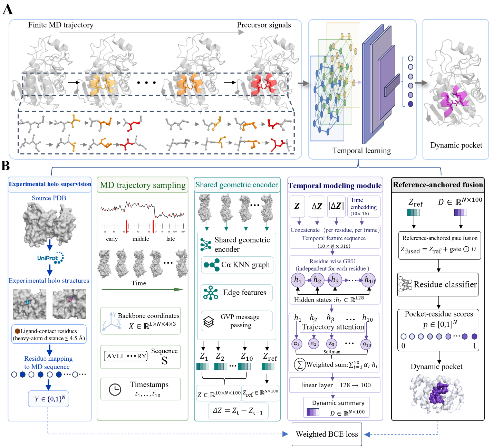

# PreDyPocket

PreDyPocket predicts protein pocket residues from molecular dynamics (MD)
trajectories. This release packages the PreDyPocket implementation with the
PocketMiner/GVP geometric encoder required to run it. Sampling, training, and
inference all start from MD trajectory inputs.

This repository is not a clinical or diagnostic tool.



The figure above is Figure 3 from the supplied PreDyPocket/CpuPDB manuscript
draft. Before public release, replace or remove it if the final publication or
publisher license requires a different figure-use policy.

## Paper Workflow

The code follows the manuscript-level PreDyPocket workflow:

1. Split each MD trajectory chronologically into early, middle, and late
   segments with a 3:3:4 length ratio.
2. Cluster each segment independently and select 3 early, 3 middle, and 4 late
   representative conformations, giving 10 ordered MD conformations per sample.
3. Encode every selected conformation with the same geometric graph encoder.
   In this release that encoder is the released PocketMiner/GVP backbone.
4. Encode the final trajectory frame separately as the reference conformation.
5. Build transition-aware residue features from per-frame embeddings, embedding
   changes, change magnitude, and time position.
6. Run residue-wise temporal modeling with a GRU and trajectory attention.
7. Fuse the dynamic summary back onto the final/reference conformation with a
   gated residual connection.
8. Train a residue-wise binary classifier with labels mapped to MD residues.
9. During inference, report residue scores and cluster residues with score >=
   0.6 into pocket candidates using C-alpha distance <= 8 A and a minimum of 4
   residues.

Implementation note: the paper describes a full PreDyPocket architecture. This
repository keeps the same data flow and temporal/reference-fusion idea, while
using PocketMiner embeddings as the geometric encoder.

## Repository Layout

```text
.
├── src/
│   ├── prepare_predypocket_data.py      # MD feature and residue-label preparation
│   ├── sample_predypocket_frames.py     # standalone 3:3:4 MD representative sampling
│   ├── train_predypocket.py             # MD trajectory model training
│   ├── predypocket_predict.py           # MD trajectory inference
│   ├── predypocket_pocketminer_model.py # temporal model wrapper
│   ├── predypocket_utils.py             # MD parsing, labels, sampling, RCSB utilities
│   ├── models.py                        # required PocketMiner model dependency
│   ├── gvp.py                           # required GVP layer dependency
│   └── util.py                          # required checkpoint helper dependency
├── scripts/
│   ├── sample_md_frames.sh
│   ├── prepare_md_data.sh
│   ├── train_from_md.sh
│   └── predict_md.sh
├── examples/dynamic_data_example/       # tiny runnable MD-format example
├── weights/                             # bundled TensorFlow checkpoints
├── docs/
└── tests/
```

Only `src/models.py`, `src/gvp.py`, and `src/util.py` are vendored from the
PocketMiner/GVP side because PreDyPocket directly depends on them. The original
static PocketMiner training pipeline and unrelated data scripts are not included.

## Installation

The code has been tested on Linux with Python 3.9, TensorFlow 2.9.1,
MDTraj 1.10.1, NumPy 1.23.5, and SciPy 1.13.1.

Create the conda environment:

```bash
conda env create -f environment.yml
conda activate predypocket
```

Or install into an existing Python 3.9 environment:

```bash
pip install -r requirements.txt
```

For GPU training, use a TensorFlow/CUDA combination compatible with your driver.
If distributed training is fragile with older TensorFlow graph code, use the
manual replica mode shown in the training command below.

## Model Weights

The complete trained PreDyPocket checkpoint is included in this repository.
No external weight download is required after cloning the repository.

The checkpoint prefix used for inference is:

```text
weights/predypocket_model
```

Each TensorFlow checkpoint prefix needs both files, for example:

```text
weights/predypocket_model.index
weights/predypocket_model.data-00000-of-00001
```

See `docs/weight_manifest.md` for the bundled file names and SHA256 checksums.

## Input MD Data

Training and inference both start from MD trajectory data. A typical dataset
layout is:

```text
dynamic_data/
└── 4KVK/
    └── 4KVK_4KVK_1.PG4_A_703/
        ├── md_dry.nc
        ├── complex.prmtop
        ├── complex.inpcrd
        ├── protein.prmtop
        └── complex_reference.pdb
```

Supported trajectory formats are handled through MDTraj and include `.nc`,
`.xtc`, `.dcd`, `.trr`, `.h5`, `.pdb`, and `.pdb.gz`. Binary trajectories need a
matching topology such as `.prmtop` or `.pdb`.

For local training labels, include either `complex.prmtop` plus `complex.inpcrd`
or a complex PDB containing protein and ligand heavy atoms. The folder name may
encode the ligand as `<resname>_<chain>_<resseq>`, for example
`4KVK_4KVK_1.PG4_A_703`.

## Toy Data and Inference Example

The release includes a tiny synthetic MD-format example under:

```text
examples/dynamic_data_example/TOY/TOY_TOY_1.LIG_B_101/
├── aa_traj.pdb
└── complex_reference.pdb
```

This bundled example is also a directly runnable inference input. It contains a
12-frame multi-model PDB trajectory with 8 alanine residues and a ligand near
the middle residues. The data are deliberately small and synthetic; they are
only for smoke testing and must not be used to evaluate model quality.

Sample the 3:3:4 representative frames:

```bash
PYTHONPATH=src python -u src/sample_predypocket_frames.py \
  --system-dir examples/dynamic_data_example/TOY/TOY_TOY_1.LIG_B_101 \
  --out-prefix outputs/toy_sample
```

Prepare labels and sampled features from the toy MD data:

```bash
PYTHONPATH=src python -u src/prepare_predypocket_data.py \
  --dynamic-root examples/dynamic_data_example \
  --out-dir outputs/toy_prepared \
  --label-methods local_contact \
  --limit 1 \
  --force \
  --workers 1
```

Run inference on the bundled toy MD trajectory with the included checkpoint:

```bash
MODEL_CHECKPOINT=weights/predypocket_model \
bash scripts/predict_md.sh \
  examples/dynamic_data_example/TOY/TOY_TOY_1.LIG_B_101 \
  outputs/toy_inference/predypocket_toy
```

The wrapper finds `aa_traj.pdb` as the multi-model trajectory and
`complex_reference.pdb` as its matching topology. The command writes:

```text
outputs/toy_inference/predypocket_toy_scores.csv
outputs/toy_inference/predypocket_toy_scores.npy
outputs/toy_inference/predypocket_toy_pockets.csv
outputs/toy_inference/predypocket_toy_selected_frames.npy
outputs/toy_inference/predypocket_toy_residue_keys.npy
```

The same example can be run through the Python entry point directly:

```bash
PYTHONPATH=src python -u src/predypocket_predict.py \
  --trajectory examples/dynamic_data_example/TOY/TOY_TOY_1.LIG_B_101/aa_traj.pdb \
  --checkpoint weights/predypocket_model \
  --out-prefix outputs/toy_inference/predypocket_toy_direct
```

## Training From MD Trajectories

The default training command starts from raw MD data, performs 3:3:4 trajectory
sampling, and builds expanded residue labels:

```bash
CUDA_VISIBLE_DEVICES=0,1,2,3 \
EPOCHS=10 \
BATCH_SIZE=4 \
EVAL_BATCH_SIZE=1 \
WORKERS=16 \
MAX_RESIDUES=1000 \
bash scripts/train_from_md.sh \
  dynamic_data \
  data/predypocket_dynamic \
  runs/predypocket
```

The script runs these two stages:

```bash
PYTHONPATH=src python -u src/prepare_predypocket_data.py \
  --dynamic-root dynamic_data \
  --out-dir data/predypocket_dynamic \
  --label-methods local_contact,homolog_contact,expanded_contact \
  --enable-rcsb \
  --homolog-identity 0.70 \
  --homolog-coverage 0.80 \
  --max-homologs 25 \
  --workers 16 \
  --worker-timeout 1200 \
  --contact-cutoff 4.5 \
  --buffer-cutoff 6.0

PYTHONPATH=src python -u src/train_predypocket.py \
  --dataset-csv data/predypocket_dynamic/dataset_expanded_contact.csv \
  --checkpoint weights/predypocket_model \
  --out-dir runs/predypocket \
  --epochs 10 \
  --batch-size 4 \
  --eval-batch-size 1 \
  --val-fraction 0.1 \
  --learning-rate 1e-4 \
  --freeze-backbone \
  --manual-gpu-replicas \
  --max-residues 1000
```

Notes:

- `--freeze-backbone` freezes the PocketMiner/GVP encoder and trains the
  temporal/ref-fusion layers plus the selected classifier parameters.
- `--manual-gpu-replicas` creates one model replica per visible GPU. It is used
  for compatibility with older TensorFlow/PocketMiner graph-mode behavior.
- `--max-residues 1000` skips very large proteins during training to avoid
  GVP memory spikes.
- Remove `--enable-rcsb` and use `--label-methods local_contact` for offline
  local-contact labels only.

One-epoch smoke training on the toy example:

```bash
PYTHONPATH=src python -u src/train_predypocket.py \
  --dataset-csv outputs/toy_prepared/dataset_local_contact.csv \
  --checkpoint weights/predypocket_model \
  --out-dir outputs/toy_train \
  --epochs 1 \
  --batch-size 1 \
  --eval-batch-size 1 \
  --val-fraction 0 \
  --learning-rate 1e-4 \
  --freeze-backbone
```

## Inference From MD Trajectories

Inference also takes an MD trajectory. The model reselects the 3:3:4
representative frames, scores residues, and clusters high-scoring residues into
pocket candidates on the final/reference frame.

Using a `dynamic_data` system directory:

```bash
MODEL_CHECKPOINT=weights/predypocket_model \
bash scripts/predict_md.sh \
  dynamic_data/4KVK/4KVK_4KVK_1.PG4_A_703 \
  outputs/4KVK_predypocket
```

Using explicit trajectory and topology paths:

```bash
PYTHONPATH=src python -u src/predypocket_predict.py \
  --trajectory path/to/traj.xtc \
  --topology path/to/topology.pdb \
  --checkpoint weights/predypocket_model \
  --out-prefix outputs/query_predypocket
```

Outputs:

```text
outputs/query_predypocket_scores.npy
outputs/query_predypocket_scores.csv
outputs/query_predypocket_pockets.csv
outputs/query_predypocket_selected_frames.npy
outputs/query_predypocket_residue_keys.npy
```

## Label Definitions

Training labels are residue-level values:

- `1`: positive pocket/contact residue.
- `0`: confident negative residue.
- `-1`: ignored residue excluded from loss and metrics.

The default `expanded_contact` label is the union of:

- Local ligand-contact positives: any protein heavy atom within 4.5 A of any
  ligand heavy atom.
- Homolog transferred positives: ligand-contact residues from sequence-similar
  RCSB complex structures mapped back to the query sequence.

Homolog transfer is positive-only evidence; it does not create negative labels.

## Validation

Run unit tests:

```bash
PYTHONPATH=src python -m unittest discover -s tests
```

Compile all source files:

```bash
python -m py_compile src/*.py
```

Run the included toy sampling command:

```bash
bash scripts/sample_md_frames.sh
```

## Reproduced Training Run

An internal run completed 10 epochs on expanded labels after filtering proteins
larger than 1000 residues. The lowest validation loss was at epoch 3, while the
highest validation ROC-AUC and PR-AUC were at epoch 9. See
`docs/training_results.md` for details.

## Citation

If you use this repository, cite:

1. The PreDyPocket/CpuPDB manuscript associated with this repository.
2. PocketMiner: cryptic pocket prediction from protein structures.
3. Geometric Vector Perceptrons for protein structure representation learning.
